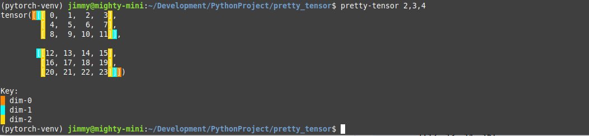
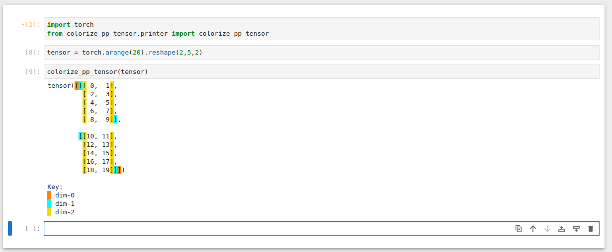

# Torch Tensor Highlighter

Torch Tensor Highlighter is a Python utility that displays PyTorch tensors with colored highlighted brackets which indicate dimensionality. It can be used as a learning tool to more easily visualize dimensions in the output or is also great for debugging in either jupyter notebook or on the command line.

It replicates the formatting of PyTorch’s native tensor output, but adds color-coded brackets by tensor dimension.

---

## Installation

Clone the repository and run the pip install script:

`pip install .`

You're good to go!

## CLI

## Jupyter Notebook

